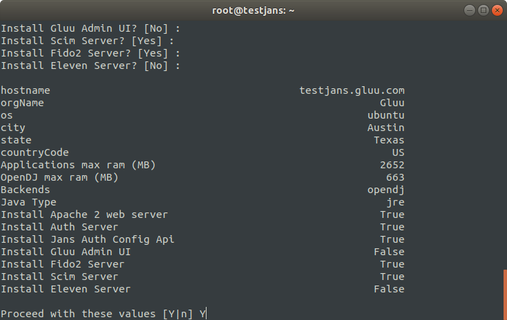
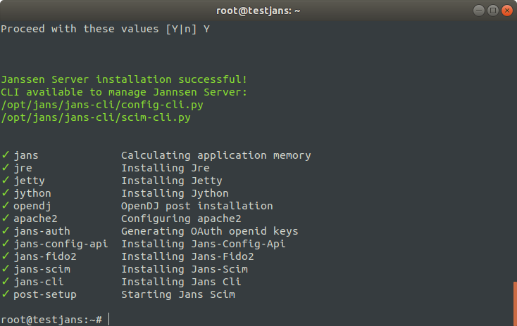
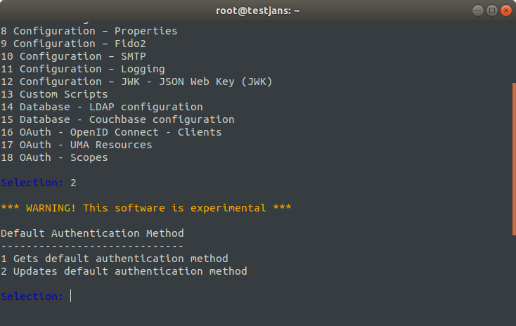

[](https://www.codacy.com/gh/JanssenProject/jans-cli/dashboard?utm_source=github.com&amp;utm_medium=referral&amp;utm_content=JanssenProject/jans-cli&amp;utm_campaign=Badge_Grade)

# _Janssen Command Line Interface_
`jans-cli` is a **Command Line Interface** for Janssen Configuration. It also has `menu-driven` interface that makes it easier to understand how to use [Janssen Server](https://github.com/JanssenProject/home) through the Interactive Mode.

Table of Contents
=================

   * [<em>Janssen Command Line Interface</em>](#janssen-command-line-interface)
   * [<em>Installation</em>](#installation)
   * [<em>Quick Start</em>](#quick-start)

# _Installation_


## Build `jans-cli.pyz` manually

## Prerequisites

1.  Python 3.6+.
1.  Python `pip3` package.

### Standard Python package

1.  Create virtual environment and activate:

    ```sh
    python3 -m venv .venv
    source .venv/bin/activate
    ```

1.  Install the package:

    ```
    make install
    ```

    This command will install executable called `jans-cli` available in virtual environment `PATH`.

### Python zipapp

1.  Install [shiv](https://shiv.readthedocs.io/) using `pip3`:

    ```sh
    pip3 install shiv
    ```

1.  Install the package:

    ```sh
    make zipapp
    ```

    This command will generate executable called `jans-cli.pyz` under the same directory.
    
**jans-cli** is automatically installed if you choose `jans-config-api` during VM installation 
of the [Janssen Server](https://github.com/JanssenProject/home).



After successfully installed Janssen Server, you will get two command-line arguments as below:



# _Quick Start_

As you have seen, CLI supports both of the `config-cli` and `scim-cli`. For a quick start, let's run the following command.

```
/opt/jans/jans-cli/config-cli.py
```
If you get an error, you can try in this way:

```
python3 /opt/jans/jans-cli/config-cli.py
```

Alternatively, you can make python3 to default version:
```
sudo update-alternatives --install /usr/bin/python python /usr/bin/python3 10
/opt/jans/jans-cli/config-cli.py
```

You will get a menu as below image:


From the following list, you can choose any options by selecting its number. For example, let's say number 2,
to get **Default Authentication Method**.

That returns another two options as below:



Now selecting 1 and it returns our desired result as below image:


So, That was a quick start to view how this _jans-cli_ Interactive Mode works. Please, follow this [link](docs) to read the _jans-cli_ docs for a better understanding of the Janssen Command-Line.
